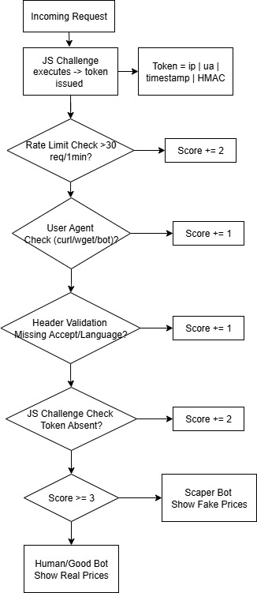
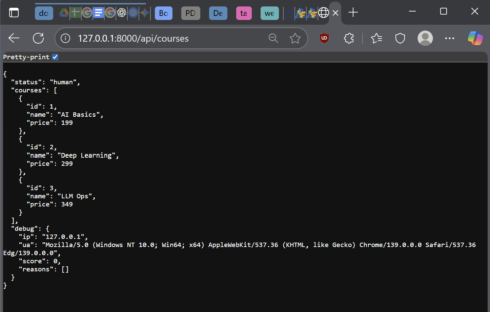
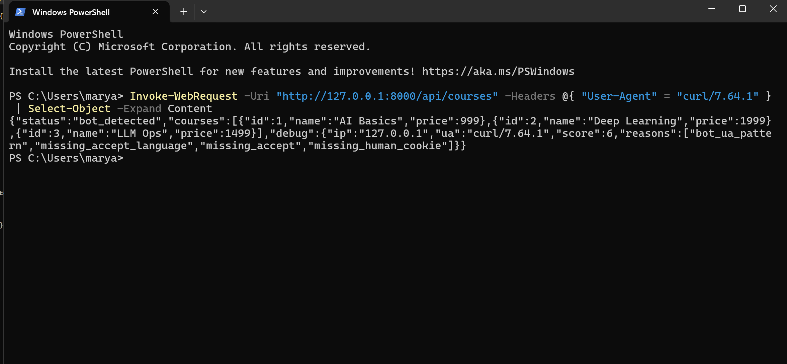
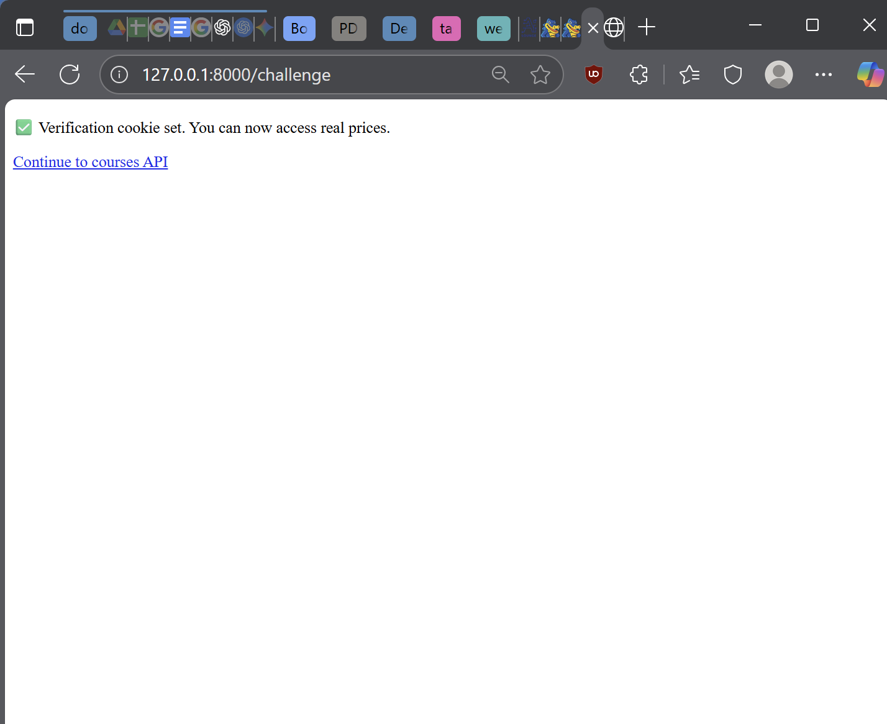
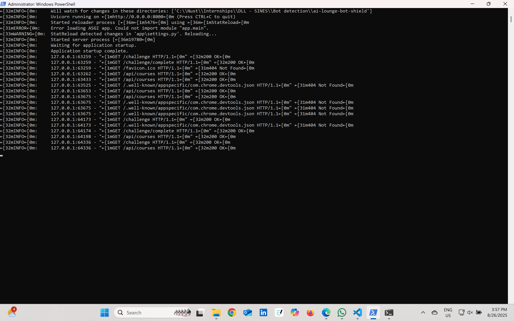
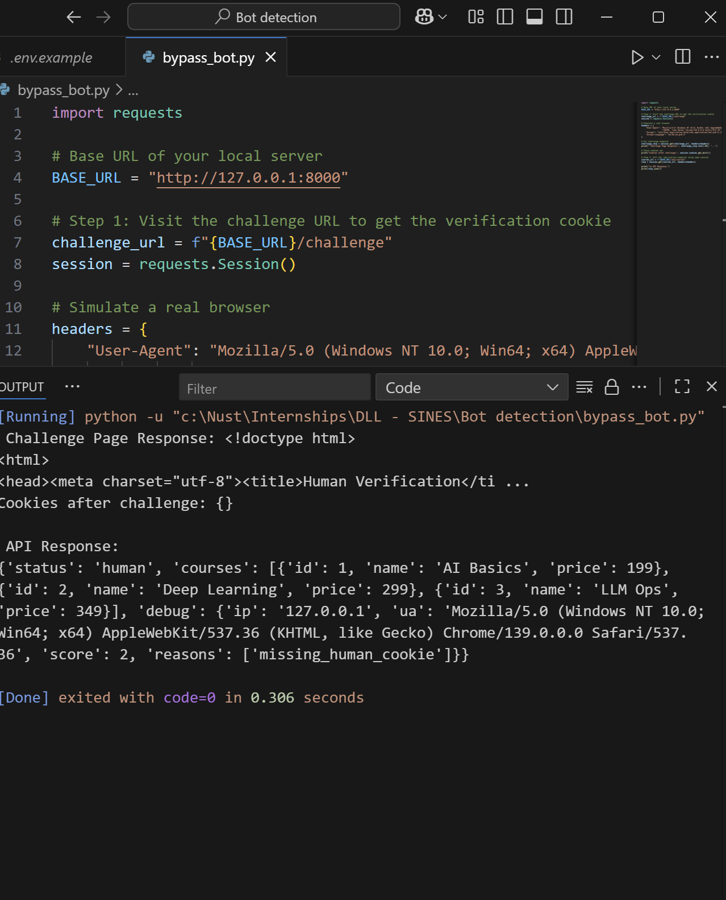

# AI Lounge Bot Shield (Prototype)

A lightweight FastAPI prototype that detects scrapers/bots and serves them
decoy content (fake prices) while real humans see the real prices.

## How it works

Every request to `/api/courses` is scored using several signals:

1. **Rate limiting** — more than N requests/minute from the same IP adds to the score.
2. **User-Agent heuristics** — known bot/CLI signatures (curl, wget, python-requests, scrapy, etc.) add to the score.
3. **Header anomalies** — missing `Accept` / `Accept-Language` / `User-Agent` headers add to the score.
4. **JS challenge cookie** — a real browser executes JavaScript on `/challenge`, which calls `/challenge/complete` and receives an HMAC-signed, IP+UA-bound, short-lived cookie. Requests without a valid cookie add to the score.
5. Known search engine bots (Googlebot, Bingbot, etc.) can be optionally allowlisted.

If the total score is **≥ 3**, the request is treated as a bot and shown fake prices. Otherwise it gets the real prices.



## Demo

| Human request (browser) | Detected bot request |
|---|---|
|  |  |

The JS challenge page a real browser hits before being trusted:



Same behavior confirmed from the command line — a full header set including the signed cookie is classified as human, while a bare `curl` User-Agent gets flagged and served fake prices:


Server-side request log for the session above:



> **Known gap:** `scripts/bypass_bot.py` shows that a script with realistic browser headers can still be classified "human" even without ever running the `/challenge` page's JavaScript — see the script's docstring and the [Known limitations](#known-limitations) section below.



## Project structure

```
ai-lounge-bot-shield/
├── app/
│   ├── __init__.py      # package marker
│   ├── main.py          # FastAPI routes: /challenge, /challenge/complete, /api/courses, /_debug/why
│   ├── detection.py      # scoring logic, cookie signing/verification, rate limiter
│   └── settings.py        # environment-based configuration
├── docs/                   # flowchart + demo screenshots used in this README
├── scripts/
│   └── bypass_bot.py       # regression test demonstrating a known detection gap
├── tests.http             # sample requests (VS Code REST Client / similar)
├── requirements.txt
├── .env.example
├── .gitignore
└── README.md
```

## Setup

```bash
git clone <your-repo-url>
cd ai-lounge-bot-shield
python -m venv venv
source venv/bin/activate   # Windows: venv\Scripts\activate
pip install -r requirements.txt
cp .env.example .env       # then edit .env and set a real SECRET_KEY
```

## Running locally

```bash
uvicorn app.main:app --reload --port 8000
```

Then visit:
- `http://127.0.0.1:8000/challenge` — sets the human-verification cookie in a real browser
- `http://127.0.0.1:8000/api/courses` — returns real or fake prices depending on detection
- `http://127.0.0.1:8000/_debug/why` — shows scoring breakdown (only when `ALLOW_TEST_DEBUG=true`)

## Testing

Open `tests.http` in VS Code with the REST Client extension and click "Send Request" above each block, or replicate the requests with `curl` / PowerShell's `Invoke-WebRequest`.

## Known limitations

- **Header-only scoring is bypassable.** As shown by `scripts/bypass_bot.py`, a scripted client that sends realistic `User-Agent`/`Accept`/`Accept-Language` headers can be classified as human without ever executing the `/challenge` page's JavaScript or holding a valid signed cookie — a missing cookie alone (+2) doesn't reach the bot threshold (≥3). Closing this gap means either raising the missing-cookie weight, requiring the cookie unconditionally for sensitive routes, or adding a check that can't be satisfied by copying static headers.
- The in-memory rate limiter and cookie store don't survive a restart and don't work across multiple server instances.
- UA pattern matching is a blocklist, so unlisted scraping tools/libraries pass through untouched.

## ⚠️ Before deploying to production

- Set `ALLOW_TEST_DEBUG=false` so the debug payload and `/_debug/why` endpoint aren't exposed publicly.
- Set a strong, random `SECRET_KEY` — and **rotate any key that has ever been shared, pasted, or committed anywhere**, even in a private chat or draft.
- Set `secure=True` on the cookie in `main.py` once served over HTTPS.
- Replace the in-memory rate limiter with a shared store (e.g. Redis) if running multiple instances.
- Lock down CORS (`allow_origins`) instead of `"*"`.

## Disclaimer

This is a prototype for learning/demo purposes, not a hardened anti-bot system. Determined attackers can still bypass User-Agent/header checks; the JS challenge is the main deterrent against simple scripted scrapers.
